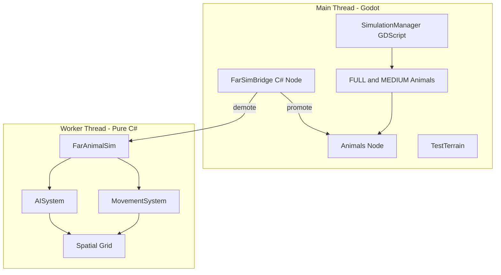

# Animal Simulation C# Port and Async FAR Implementation Plan

## Architecture Overview




---

## Phase 1: C# Project Setup and Foundation

**Goal**: Establish C# in the project and verify Godot 4 .NET integration.

**Tasks**:

- Generate or create `BiologyGame.csproj` (Godot typically creates this when adding a C# script; if missing, use `dotnet new` or Godot's project setup).
- Create folder structure: `src/scripts/csharp/` (or `src/scripts/Animals/`, `src/scripts/Simulation/` as you prefer).
- Add a minimal C# `Node` script, attach to a test node, and confirm the project builds and runs.
- Document any build/export configuration changes needed.

**Deliverable**: Project compiles, runs, and C# scripts can be attached to nodes.

---

## Phase 2: Port Animal AI to C#

**Goal**: Replace GDScript animal scripts with C# equivalents while preserving behavior.

**Files to create**:

- `src/scripts/csharp/Animals/AnimalBase.cs` — extends `CharacterBody3D`, mirrors [animal_base.gd](src/scripts/animals/animal_base.gd).
- `src/scripts/csharp/Animals/HunterAnimal.cs` — extends `AnimalBase`, mirrors [hunter_animal.gd](src/scripts/animals/hunter_animal.gd).
- `src/scripts/csharp/Animals/ForagerAnimal.cs` — extends `AnimalBase`, mirrors [forager_animal.gd](src/scripts/animals/forager_animal.gd).

**Key considerations**:

- Keep [simulation_manager.gd](src/scripts/game/simulation_manager.gd) in GDScript for now. C# animals call it via `GetTree().GetFirstNodeInGroup("simulation_manager")` and invoke `GetAnimalsInRadius`, `GetHuntersInRadius`, `GetPlantsInRadius`, `GetSameSpeciesInRadius` via `Call()` or `GD.Get()`.
- Map GDScript signals to C# events (e.g. `AnimalDefeated`).
- Ensure `ProcessFarTick` exists and matches the signature expected by SimulationManager (`process_far_tick(delta, ai_tick, move_tick)`).
- Update scene files: change `script` in [forager_animal.tscn](src/scenes/animals/forager_animal.tscn), [hunter_animal.tscn](src/scenes/animals/hunter_animal.tscn), [animal_base.tscn](src/scenes/animals/animal_base.tscn) to reference `.cs` scripts.
- Update [world_populator.gd](src/scripts/world/world_populator.gd) scene references if paths change; scene paths (`forager_scene`, `hunter_scene`) stay the same.

**Deliverable**: All 1000 animals (750 foragers, 250 hunters) run as C# nodes with identical behavior. Performance baseline established.

---

## Phase 3: Extract Shared Logic Layer (Pure C#)

**Goal**: Isolate simulation logic from Godot so it can run without the engine (for the async worker).

**Files to create**:

- `src/scripts/csharp/Simulation/AnimalStateData.cs` — struct holding: `Position`, `Velocity`, `State` (Wander/Panic), `Species`, `Health`, `PanicTimer`, `WanderTimer`, `WanderTarget`, `ThreatPosition`, and static params (e.g. `WanderSpeed`, `PanicSpeed`, `SocialFactor`, `CohesionRadius`, `ContagionRadius`).
- `src/scripts/csharp/Simulation/AnimalLogic.cs` — static or instance class with:
  - `UpdateStateFar(delta, state, neighborPositions, neighborStates)` — contagion, panic decay, wander target refresh.
  - `ApplySimpleWander(delta, state, cohesionVector)` — velocity computation.
  - No `Node`, `Vector3` is fine (Godot has `Vector3` in C#).
- Refactor `AnimalBase.cs` so FULL/MEDIUM logic delegates to `AnimalLogic` where possible, or at least shares the same math. FAR logic should be fully delegatable to `AnimalLogic`.

**Data flow**:

- Main-thread `AnimalBase` uses `AnimalLogic` for FAR ticks (called from `ProcessFarTick`) so behavior stays identical.
- Prepares the async sim to use the same logic on worker-thread data.

**Deliverable**: `AnimalLogic` is pure C#, testable in unit tests, and used by `AnimalBase` for FAR behavior.

---

## Phase 4: Async FAR Sim — Data-Oriented Core

**Goal**: Run FAR animal simulation on a background thread using an ECS-style, data-oriented design.

### 4a: Data Structures

**File**: `src/scripts/csharp/Simulation/FarAnimalSim.cs`

Use a **Structure of Arrays (SoA)** for cache-friendly iteration:

```csharp
// SoA layout - each array indexed by animal id
struct FarAnimalComponents
{
    public Vector3[] Positions;
    public Vector3[] Velocities;
    public int[] States;           // 0=Wander, 1=Panic
    public int[] Species;
    public float[] PanicTimers;
    public float[] WanderTimers;
    public Vector3[] WanderTargets;
    public Vector3[] ThreatPositions;
    public float[] WanderSpeeds;
    public float[] PanicSpeeds;
    public float[] SocialFactors;
    public int Count;
}
```

Alternatively, a compact **Array of Structs (AoS)** if struct is small (~80 bytes):

```csharp
struct FarAnimalData { ... }
FarAnimalData[] _animals;
```

Recommendation: Start with AoS for simplicity; migrate to SoA in Phase 7 if profiling shows benefit.

### 4b: Spatial Partitioning

**File**: `src/scripts/csharp/Simulation/FarSpatialGrid.cs`

- Cell size: match [simulation_manager.gd](src/scripts/game/simulation_manager.gd) `CELL_SIZE = 24`.
- `Dictionary<Vector2i, List<int>>` mapping cell key to animal indices.
- `RebuildGrid()` each frame (or every N ticks) from `Positions`.
- `GetSameSpeciesInRadius(center, radius, species, excludeId)` returns indices for contagion/cohesion.

### 4c: Heightmap Pre-bake

**File**: `src/scripts/csharp/Simulation/HeightmapSampler.cs`

- At sim start, the main thread reads terrain via `get_height_at` and fills a 2D `float[,]` (or 1D with `x + z * width`).
- Pass `terrain_size`, `height_min`, `height_max`, and the sampled array to the worker. Worker uses it for:
  - Movement (optional: FAR animals may keep y fixed or use sampled height).
  - Promotion: set `position.Y = height + 0.3` when creating the node.

### 4d: Systems

- **AISystem**: For each animal (or chunk), call `AnimalLogic.UpdateStateFar` with neighbor data from the spatial grid. Writes to `States`, `Timers`, `Velocities`, `WanderTargets`, `ThreatPositions`.
- **MovementSystem**: Apply `Velocity * delta` to `Position`. Optionally sample height for Y.

Run order: AISystem → MovementSystem. Single-threaded for Phase 4.

### 4e: Worker Thread

- `FarAnimalSim` runs in a `System.Threading.Task` or `Thread`.
- Update loop: fixed timestep (e.g. 1/20 s) or variable `delta` from main thread.
- Main thread passes: `playerPos`, `delta` (or tick count). Worker never touches Godot APIs.
- Use `ConcurrentQueue` or lock-protected lists for **promote** and **demote** commands (main produces, worker consumes for its bookkeeping; worker produces "needs promotion" list, main consumes).

**Deliverable**: `FarAnimalSim` runs FAR logic for N animals on a worker thread with spatial queries and height sampling. No Godot types in the hot path.

---

## Phase 5: LOD Promotion and Demotion Bridge

**Goal**: Move animals between the scene tree (MEDIUM) and the async sim (FAR).

**File**: `src/scripts/csharp/Simulation/FarSimBridge.cs` — extends `Node`, lives in the World scene.

**Responsibilities**:

1. **Demotion (MEDIUM → FAR)**: When SimulationManager (or this bridge) detects an animal in MEDIUM moving past `medium_sim_radius + hysteresis` (e.g. 95 m):
  - Read state from the `CharacterBody3D` (position, velocity, health, species, state, timers).
  - Enqueue "demote" for worker; remove node from tree (`QueueFree()` or reparent to a hidden stash — prefer `RemoveChild` + pool for promotion later).
2. **Promotion (FAR → MEDIUM)**: Every 15–30 s (configurable), worker returns a list of animal indices whose distance to player < `medium_sim_radius - hysteresis` (e.g. 85 m):
  - Main thread, via `CallDeferred` or `Callable.From`:
    - Instantiate appropriate scene (forager vs hunter) from `PackedScene`.
    - Set position (using `HeightmapSampler` or terrain `GetHeightAt` for Y).
    - Restore state (velocity, health, species, state, timers) from `FarAnimalData`.
    - Add to `Animals` node.
3. **Hysteresis**: Use `demoteRadius = 95`, `promoteRadius = 85` to avoid thrashing.
4. **Review timer**: `Timer` node or manual accumulation; on timeout, request promotion list from worker and perform promotions.

**Integration with SimulationManager**:

- Option A: Replace `_process_far_animals` in GDScript with a check that delegates to FarSimBridge — if FarSimBridge owns FAR animals, it does nothing for them (they are not in the tree).
- Option B: FarSimBridge subscribes to a custom group or signal; SimulationManager emits "animal entered FAR" / "animal left FAR" for the bridge to demote/promote.
- Recommendation: SimulationManager stays in GDScript but no longer iterates FAR animals (they are removed). FarSimBridge owns the LOD boundary logic for FAR and calls into `FarAnimalSim` for demotion/promotion.

**Deliverable**: Animals smoothly transition between MEDIUM (scene) and FAR (async sim). No duplicate simulation, correct state on promotion.

---

## Phase 6: Multithreading Within FAR Sim (Parallel Systems)

**Goal**: Use `Parallel.For` or `Parallel.ForEach` to process animal chunks in parallel.

**Approach**:

- Partition animals into chunks (e.g. 64–128 per chunk).
- **AISystem**: Each chunk reads `Positions`, `States` of all animals (for spatial queries). Use a thread-safe spatial grid or pre-build a read-only grid before the parallel pass. Each chunk writes only to its own animals' indices — no overlapping writes.
- **MovementSystem**: Trivially parallel (each animal writes only its own position).
- Use `System.Threading.Tasks.Parallel.For(0, chunkCount, i => ProcessChunk(i))`.

**Caveats**:

- Spatial grid rebuild must complete before the AI pass (or use a double-buffered grid).
- Contagion reads neighbors; ensure chunk boundaries don't cause races (neighbors in the same or adjacent cells). If chunks are spatial (e.g. by grid cell), nearby animals may be in different chunks — reads are fine, writes must be exclusive per animal.

**Deliverable**: FAR sim utilizes multiple cores. Measure speedup with 1000+ FAR animals.

---

## Phase 7: Optional Enhancements (Later Phases)

### 7a: Port SimulationManager to C#

- Convert [simulation_manager.gd](src/scripts/game/simulation_manager.gd) to C#.
- Spatial queries (`GetAnimalsInRadius`, etc.) can use `Span<T>`, native arrays, or tighter loops for better performance.
- Enables a unified C# simulation layer.

### 7b: Object Pooling for Promotion

- Pre-instantiate a pool of forager/hunter nodes.
- On promotion, get from pool, set state, add to tree.
- On demotion, remove from tree, return to pool.
- Reduces allocation spikes during rapid LOD transitions.

### 7c: SoA Migration (if AoS Bottleneck)

- Convert `FarAnimalData[]` to SoA layout.
- Improves cache locality for system loops that touch a subset of components (e.g. MovementSystem only needs Position, Velocity).

### 7d: SIMD / Batch Math

- Use `System.Numerics.Vector3` or `System.Runtime.Intrinsics` for batch distance checks in spatial queries.
- Process 4–8 positions per iteration.

### 7e: Async Plant State (Optional)

- FAR foragers currently do not eat plants. If desired, add a simplified plant grid to the async sim (position + health) so far foragers can "consume" plants; sync depleted plants back to the main thread periodically.

### 7f: Save/Load Persistence

- Serialize `FarAnimalSim` state (positions, velocities, species, etc.) for save games.
- On load, restore both scene-tree animals and async FAR animals.

### 7g: Telemetry and Profiling

- Add debug overlay or logs for: FAR animal count, promote/demote rate, worker thread frame time, main-thread simulation budget.
- Use Godot's `Performance` singleton and custom timers to validate gains.

---

## Suggested File Layout (Final)

```
src/scripts/
├── csharp/
│   ├── Animals/
│   │   ├── AnimalBase.cs
│   │   ├── HunterAnimal.cs
│   │   └── ForagerAnimal.cs
│   └── Simulation/
│       ├── AnimalStateData.cs
│       ├── AnimalLogic.cs
│       ├── FarAnimalSim.cs
│       ├── FarSpatialGrid.cs
│       ├── HeightmapSampler.cs
│       └── FarSimBridge.cs
├── game/
│   └── simulation_manager.gd    (unchanged until Phase 7a)
└── animals/                      (deprecated after Phase 2)
    └── *.gd
```

---

## Risk Mitigation


| Risk                         | Mitigation                                                                                |
| ---------------------------- | ----------------------------------------------------------------------------------------- |
| C#/GDScript interop overhead | Keep hot paths in pure C#; minimize per-frame cross-boundary calls.                       |
| Thread safety bugs           | Strict rule: worker never touches Godot APIs; main thread owns all scene tree operations. |
| State desync on promote      | Comprehensive round-trip tests; checklist of all fields to copy.                          |
| FAR count explosion          | Cap async sim size or reduce tick rate if count exceeds threshold.                        |


---

## Success Criteria

- Phase 2: C# animals behave identically to GDScript; no regressions.
- Phase 4–5: FAR animals are removed from the scene tree; main-thread `_physics_process` cost for FAR drops to near zero.
- Phase 6: FAR sim scales to 2000+ animals with measurable parallelism benefit.
- Phases 7: Incremental improvements validated by profiling.

