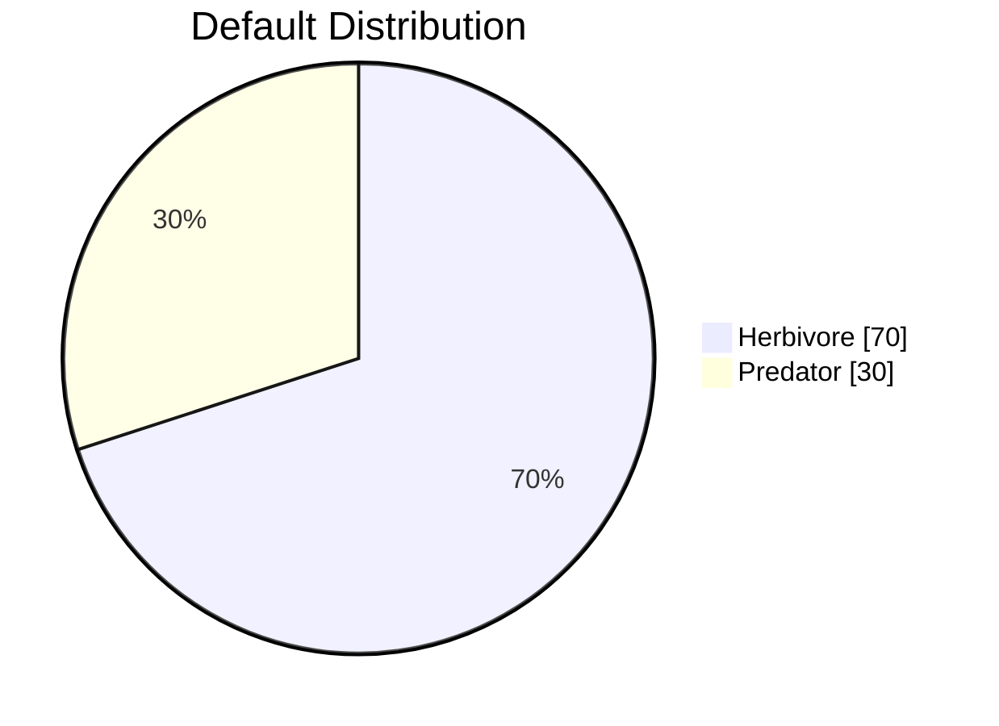
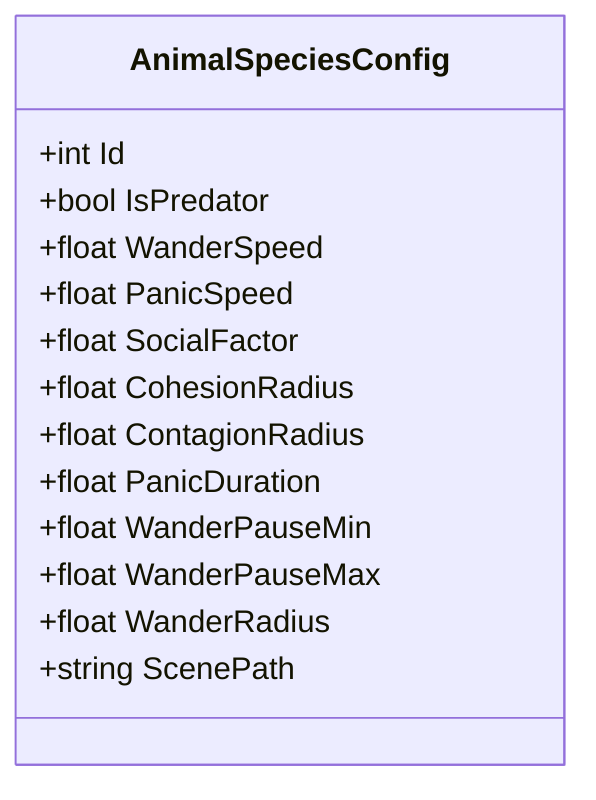
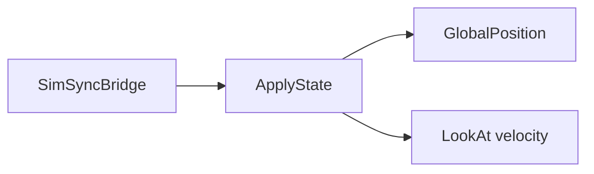
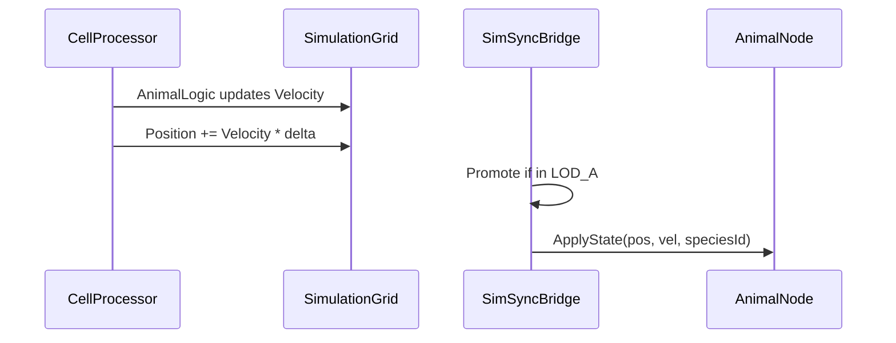

# Animals and Plants

Species configuration, AnimalNode/PlantNode presentation, and shared simulation state.

## Species

Two species are configured in SimSyncBridge:

| ID | Type | Description |
|----|------|-------------|
| 0 | Herbivore | Eats plants; wanders; panics from contagion |
| 1 | Predator | Same base logic; different speed/radius presets |

Ratio controlled by `HerbivoreRatio` export (default 0.7).

## AnimalSpeciesConfig

Presets: `CreateHerbivore()`, `CreatePredator()`. Tune in `SimSyncBridge._Ready()`.

## AnimalStateData

Shared struct for simulation; no Godot types:

| Field | Type | Description |
|-------|------|-------------|
| Position, Velocity | Vector3 | Transform and movement |
| State | int | 0=Wander, 1=Panic |
| SpeciesId | int | 0=herbivore, 1=predator |
| CellX, CellZ | int | Grid cell |
| PanicTimer, WanderTimer | float | State timers |
| WanderTarget, ThreatPosition | Vector3 | AI targets |
| WanderSpeed, PanicSpeed, etc. | float | From species config |

## AnimalNode

Thin Godot wrapper for promoted animals:

- **ApplyState(worldPosition, velocity, speciesId)**: Set position; orient mesh toward movement direction.
- No simulation logic; receives state from SimSyncBridge each sync.

## PlantStateData

| Field | Type | Description |
|-------|------|-------------|
| Position | Vector3 | World position |
| CellX, CellZ | int | Grid cell |
| Health | int | Current health |
| IsConsumed | bool | Health <= 0 |
| SpeciesId | int | For variety |

## PlantNode

Thin Godot wrapper for promoted plants:

- **ApplyState(worldPosition, isConsumed)**: Set position; show/hide or swap mesh by consumed state.

## State Flow

## Scene Structure

- **animal_base.tscn**: Node3D root, MeshInstance3D child
- **plant_base.tscn**: Node3D root, StaticBody3D, mesh

Scripts: `AnimalNode.cs`, `PlantNode.cs`.
