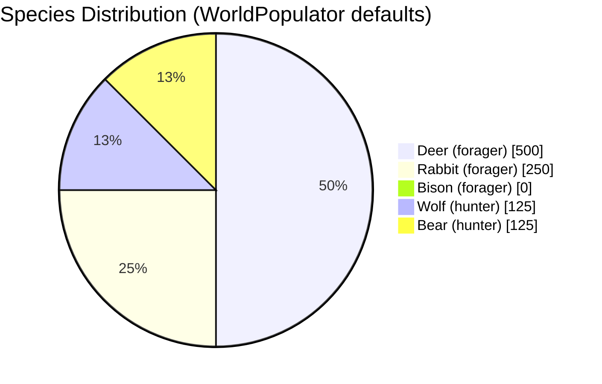
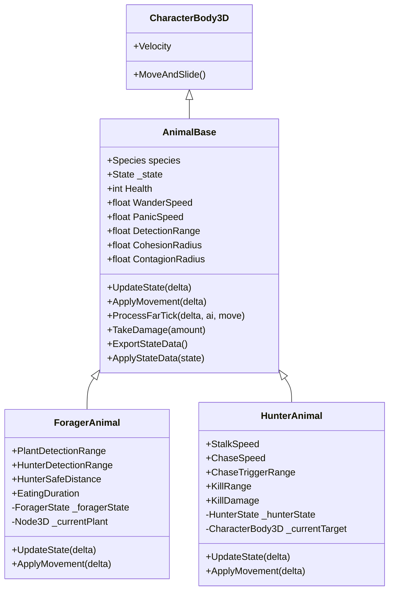
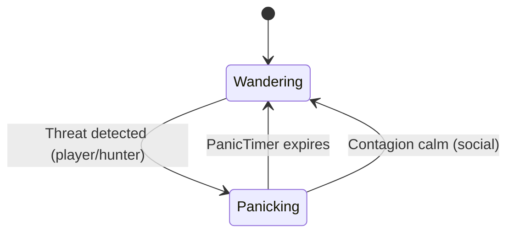
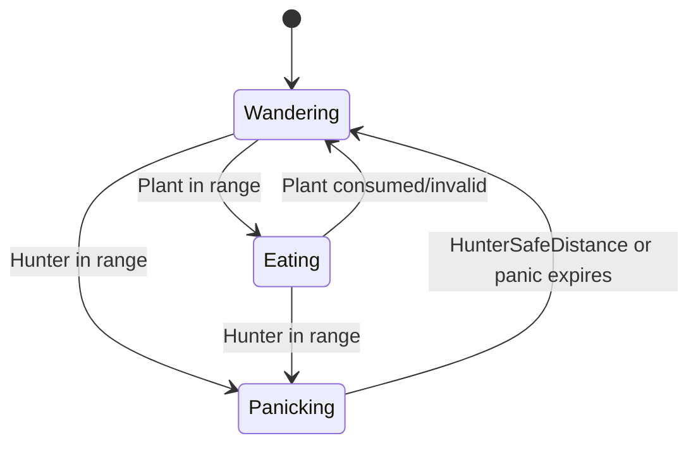
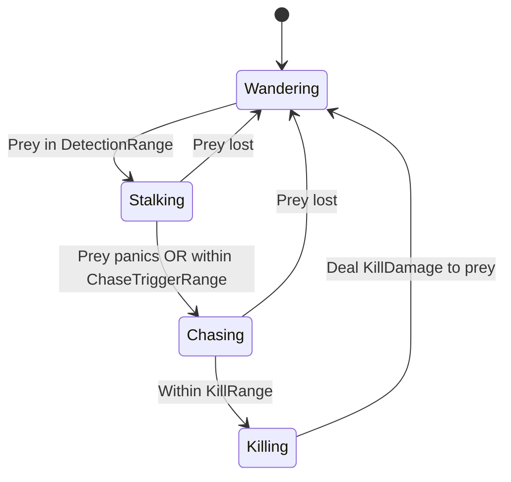
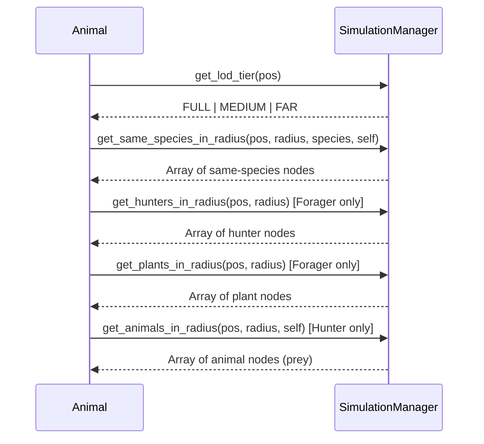

# Animals

This document covers animal species, AI behaviors, and the class hierarchy.

## Species

| ID | Species | Type | Notes |
|----|---------|------|-------|
| 0 | Bison | Forager | Default base animal |
| 1 | Deer | Forager | Eats plants, flees hunters |
| 2 | Rabbit | Forager | Eats plants, flees hunters |
| 3 | Wolf | Hunter | Stalks, chases, kills prey |
| 4 | Bear | Hunter | Stalks, chases, kills prey |

Species IDs are defined in `species_constants.gd` and `AnimalBase.Species` (C#) and must match.

## Class Hierarchy

## AnimalBase States

### Base Behaviors

- **Wandering**: Pick random target within `WanderRadius`, move toward it, pause between targets.
- **Panicking**: Move away from `_threatPosition` at `PanicSpeed`.
- **Contagion**: Nearby panicking same-species can spread panic; nearby calm same-species can shorten panic.
- **Cohesion**: In FULL LOD, apply social vector toward center of same-species in `CohesionRadius`.

## ForagerAnimal States

### Forager-Specific Behaviors

- **Eating**: Stay still, call `plant.consume()` each `EatingDuration` seconds.
- **Hunter flee**: Detect hunters via `get_hunters_in_radius()`, panic until `HunterSafeDistance` or hunter gone.
- **Plant detection**: `get_plants_in_radius()` for non-consumed plants.

## HunterAnimal States

### Hunter-Specific Behaviors

- **Stalking**: Move toward prey at `StalkSpeed` (with cohesion in FULL).
- **Chasing**: Move toward prey at `ChaseSpeed` when prey panics or is within `ChaseTriggerRange`.
- **Killing**: Stop, call `prey.take_damage(KillDamage)` (typically 999).
- **Prey selection**: `get_animals_in_radius()` excluding hunters.

## SimulationManager Integration

Animals query SimulationManager for spatial data:

## Groups

| Group | Used By |
|-------|---------|
| `animals` | All animals (base, forager, hunter) |
| `foragers` | ForagerAnimal |
| `hunters` | HunterAnimal |
| `simulation_manager` | SimulationManager (for lookup) |
| `player` | Player (for threat/raycast) |
| `plants` | Plant nodes |

## Signals

- **AnimalDefeated**: Emitted when `Health <= 0` after `TakeDamage`. Used for future XP/loot.

## Scene Structure

Each animal scene has:

- `CharacterBody3D` root (C# script)
- `Model` child (MeshInstance3D or packed scene) — PS1 effect applied in `_Ready` if `UsePs1Effect`
- Debug `Label3D` and `MeshInstance3D` added at runtime (SimulationManager debug mode)
