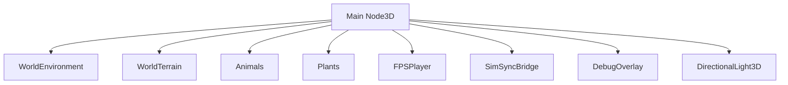
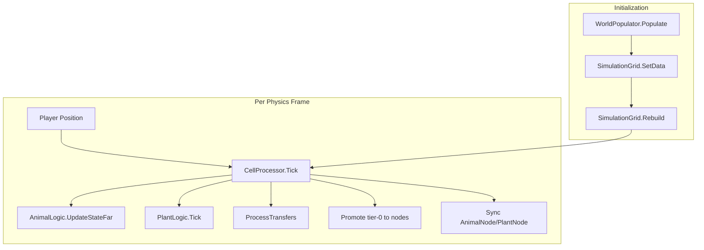
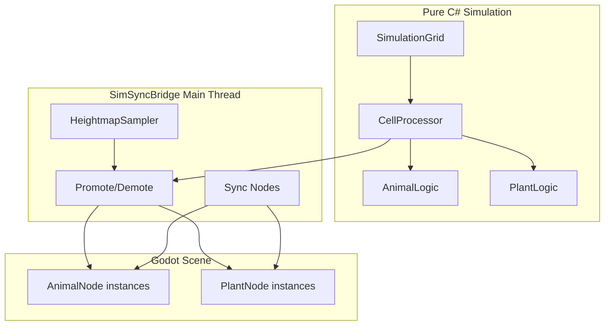
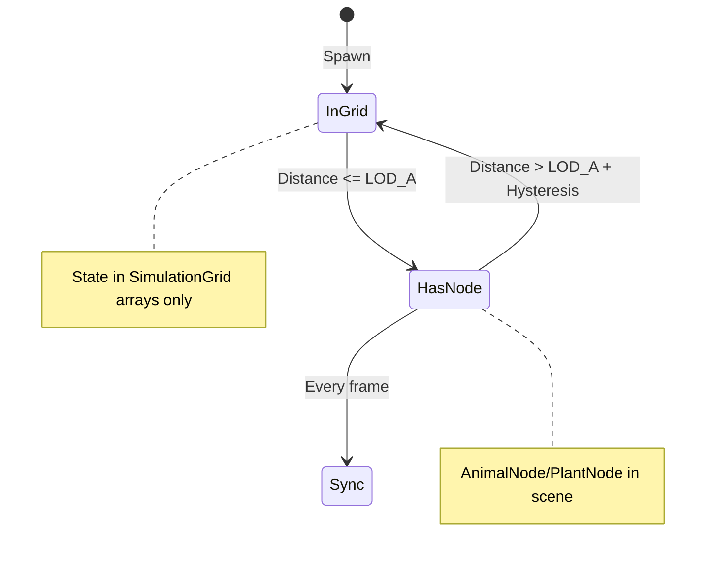

# Architecture Overview

High-level architecture of BiologyGame: scene hierarchy, data flow, and simulation structure.

## Scene Hierarchy



**Key relationships:** SimSyncBridge promotes entities to Animals/Plants, reads player position from FPSPlayer, and samples terrain from WorldTerrain.

## Data Flow



## Simulation Architecture



## LOD Promotion Flow



## File Layout

```
src/
├── main.tscn
├── project.godot
├── scripts/
│   ├── game/           # world_constants.gd
│   ├── player/         # fps_controller.gd
│   ├── world/          # terrain_bootstrap.gd
│   ├── ui/             # debug_overlay.gd, debug_overlay_draw.gd
│   └── csharp/
│       ├── Simulation/ # SimSyncBridge, SimulationGrid, CellProcessor,
│       │               # AnimalLogic, PlantLogic, WorldPopulator,
│       │               # SimConfig, AnimalStateData, PlantStateData,
│       │               # AnimalSpeciesConfig, HeightmapSampler
│       ├── Animals/    # AnimalNode.cs
│       └── Plants/     # PlantNode.cs
├── scenes/
│   ├── world/          # world_terrain.tscn
│   ├── player/         # fps_player.tscn
│   ├── animals/        # animal_base.tscn
│   ├── plants/         # plant_base.tscn
│   └── ui/             # debug_overlay.tscn
├── terrain_data/       # Yellowstone heightmap
└── addons/terrain_3d/
```

## Key Integration Points

| Component | Role |
|-----------|------|
| **SimSyncBridge** | Main-thread bridge; owns SimulationGrid, CellProcessor; promotes/demotes entities; syncs AnimalNode/PlantNode; exposes GetSnapshotArray for debug overlay |
| **SimulationGrid** | N×N spatial grid; cell assignment; neighbor queries; GetSnapshot for overlay |
| **CellProcessor** | Drives sim per cell; calls AnimalLogic/PlantLogic; ProcessTransfers at interval |
| **AnimalNode / PlantNode** | Thin Godot wrappers; ApplyState from bridge; no simulation logic |
| **DebugOverlay** | Fetches snapshot from SimSyncBridge; draws LOD grid, dots, player |
