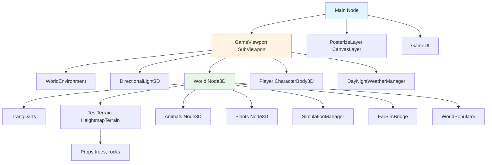
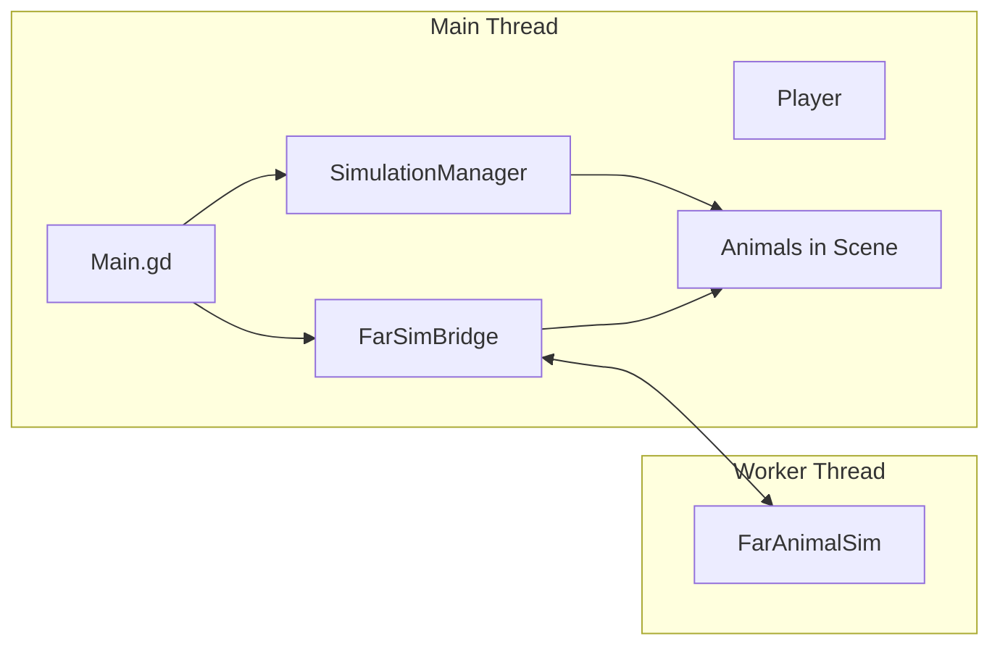
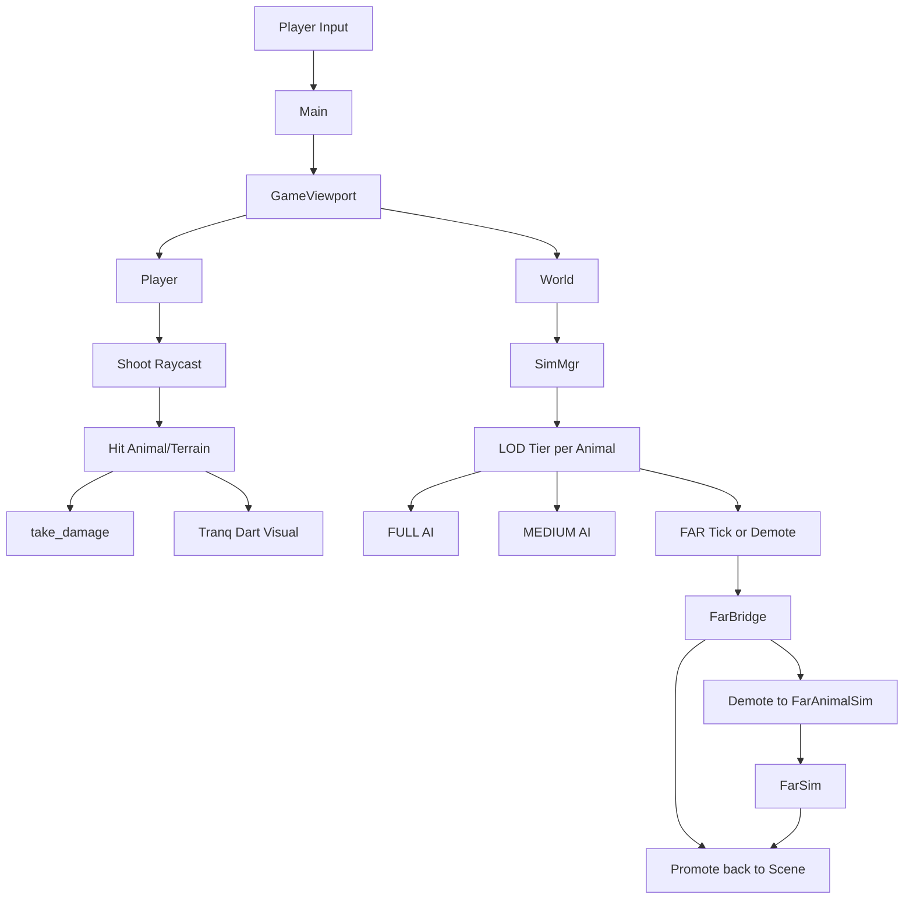
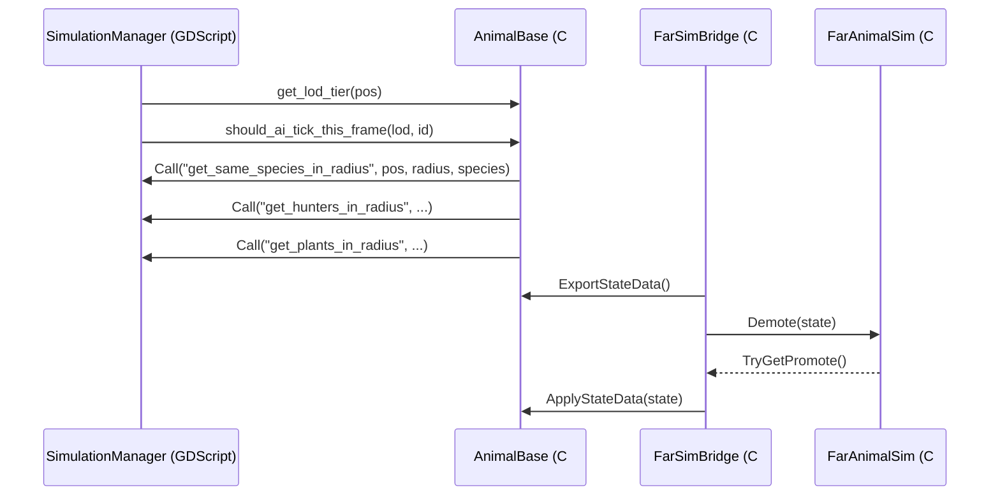

# Architecture Overview

This document describes the high-level architecture of BiologyGame, including the scene hierarchy, data flow, and cross-language integration.

## Scene Hierarchy



## System Architecture Diagram



## Data Flow Overview



## Cross-Language Integration

BiologyGame uses **GDScript** for game logic, world setup, and simulation orchestration, and **C#** for animal AI and high-performance FAR simulation.



### Key Integration Points

| From | To | Mechanism |
|------|-----|-----------|
| C# Animal | SimulationManager | `GetTree().GetFirstNodeInGroup("simulation_manager")` + `Call("method_name", ...)` |
| FarSimBridge | Terrain | `_terrainNode.Call("get_height_at", x, z)` via HeightmapSampler (main thread only) |
| FarSimBridge | Animals | `scene.Instantiate()`, `AddChild()`, `ApplyStateData()` |
| AnimalLogic | AnimalBase | Shared `AnimalStateData` struct, no Godot APIs |

## Process Order

SimulationManager and FarSimBridge use `set_process_priority()` to control execution order:

| Priority | Component | Purpose |
|----------|-----------|---------|
| -100 | SimulationManager | Runs first: rebuilds grid, processes FAR animals in scene |
| -50 | FarSimBridge | Runs after: demotes/promotes animals to/from async sim |
| 0 (default) | Animals | Full/Medium LOD `_physics_process` |

## File Layout

```
src/
├── main.tscn, project.godot
├── scripts/
│   ├── game/           # main.gd, simulation_manager.gd, day_night_weather_manager.gd
│   ├── player/         # player.gd
│   ├── animals/        # species_constants.gd
│   ├── plants/         # plant.gd
│   ├── world/          # world_populator.gd, heightmap_terrain.gd
│   ├── props/          # ps1_material_builder.gd, random_tree.gd, random_rock.gd
│   ├── weapons/        # tranq_dart.gd
│   └── csharp/         # Animals/*.cs, Simulation/*.cs
├── scenes/
│   ├── world/          # world.tscn, test_terrain.tscn
│   ├── player/         # player.tscn
│   ├── animals/        # animal_base.tscn, forager_animal.tscn, hunter_animal.tscn
│   ├── plants/         # plant.tscn
│   ├── props/          # random_tree.tscn, random_rock.tscn
│   └── weapons/        # tranq_dart.tscn
├── shaders/            # ps1_style.gdshader, posterize.gdshader, terrain_heightmap.gdshader
├── materials/          # terrain, ps1 ground
├── environments/       # ps1_environment.tres
└── ui/                 # game_ui.tscn, crosshair, health bar
```
