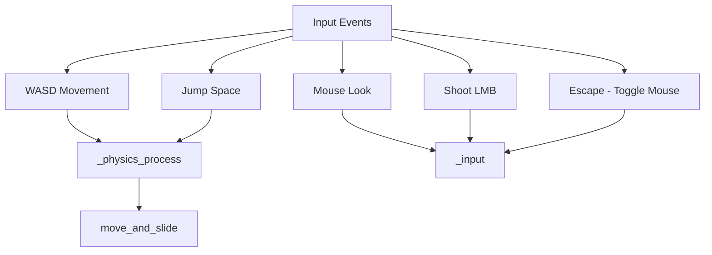
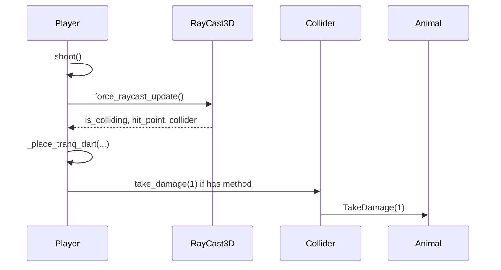
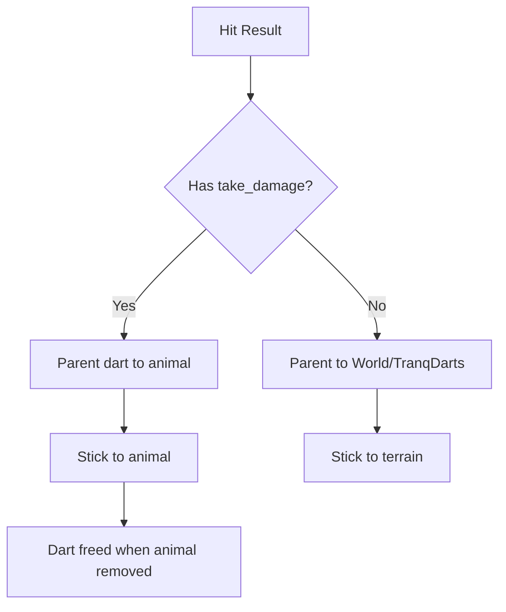

# Player & Combat

This document covers the FPS player controller and combat (shooting, tranq darts).

## Player Controller



### Controls

| Action | Input |
|--------|-------|
| Move | W A S D |
| Jump | Space |
| Shoot | Left mouse button |
| Toggle mouse capture | Escape |

### Movement Parameters

| Constant | Value | Description |
|----------|-------|-------------|
| SPEED | 5.0 | Normal walk |
| SPEED_BOOST | 10.0 | When Shift held (testing) |
| JUMP_VELOCITY | 4.5 | Jump strength |
| MOUSE_SENSITIVITY | 0.002 | Look sensitivity |
| CAMERA_PITCH_LIMIT | 89° | Vertical look limit |

### Input Flow

1. `main.gd` pushes input to `GameViewport` SubViewport.
2. Player receives input inside the viewport.
3. Backtick (`) toggles SimulationManager debug mode (handled in main before viewport push).

## Shooting



### Raycast

- Attached to `Player/Camera3D/RayCast3D`.
- Fires from camera center on shoot action.
- Returns `collision_point`, `collision_normal`, `collider`.

### Damage

- If collider has `take_damage(amount)` (e.g. animals), it is called with 1 damage.
- Animals: `TakeDamage()` reduces health, triggers panic from player position; if health <= 0, emits `animal_defeated` and `QueueFree()`.

## Tranq Dart



### Placement

- Instantiated from `res://scenes/weapons/tranq_dart.tscn`.
- Position: `hit_point + dir_toward_player * DART_OFFSET` (0.08) to avoid z-fighting.
- Orientation: `Basis.looking_at(dir_toward_player, up_hint)`.
- **Parent**: If hit object has `take_damage` (animal), parent to animal so dart disappears when animal is removed; otherwise parent to `World/TranqDarts`.

## Scene Hierarchy

```
Player (CharacterBody3D)
├── Camera3D
│   └── RayCast3D
└── (collision shape, etc.)
```

Player is a sibling of World under GameViewport; raycast hits world geometry and animals in the same viewport.
