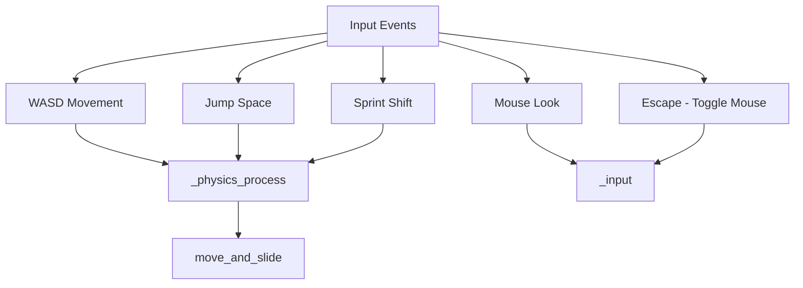

# Player

FPS controller and input handling.

## FPS Controller



### Controls

| Action | Input |
|--------|-------|
| Move | W A S D |
| Sprint | Shift |
| Jump | Space |
| Toggle mouse capture | Escape |
| Toggle debug overlay | F1 or Backtick (`) |

### Parameters (fps_controller.gd)

| Export | Default | Description |
|--------|---------|-------------|
| move_speed | 8.0 | Walk speed |
| sprint_speed | 14.0 | Sprint speed |
| jump_velocity | 6.0 | Jump strength |
| mouse_sensitivity | 0.002 | Look sensitivity |
| pitch_limit | 89.0 | Vertical look limit (degrees) |

## Scene Hierarchy

```
FPSPlayer (CharacterBody3D)
├── Camera3D
└── (collision shape, etc.)
```

Player is in group `player`; SimSyncBridge and DebugOverlay look it up for position.
