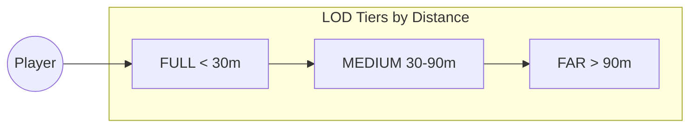
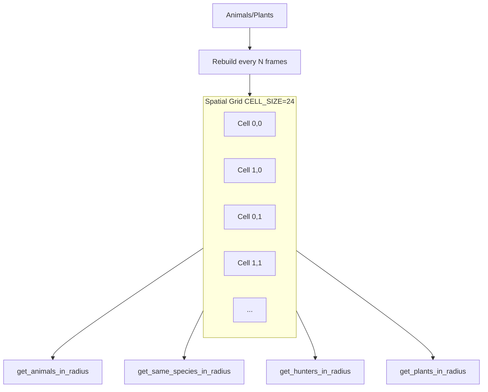
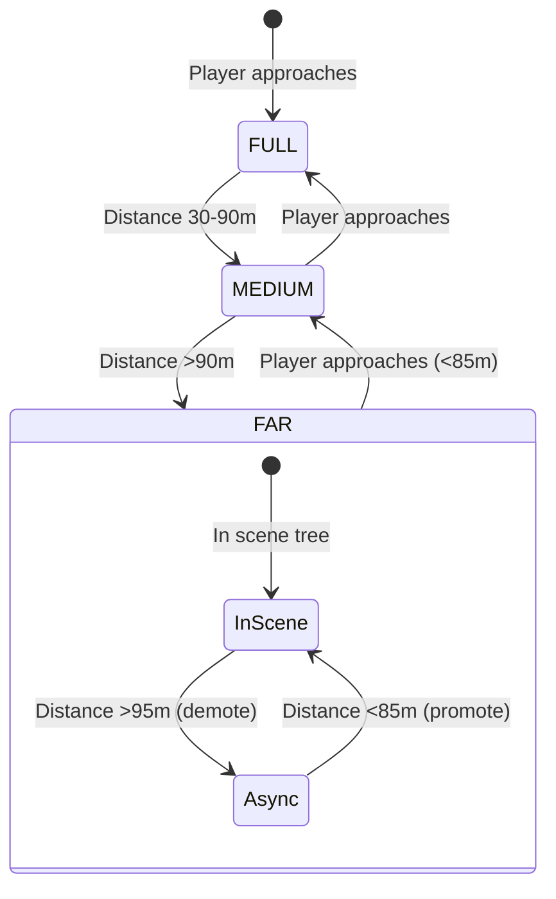
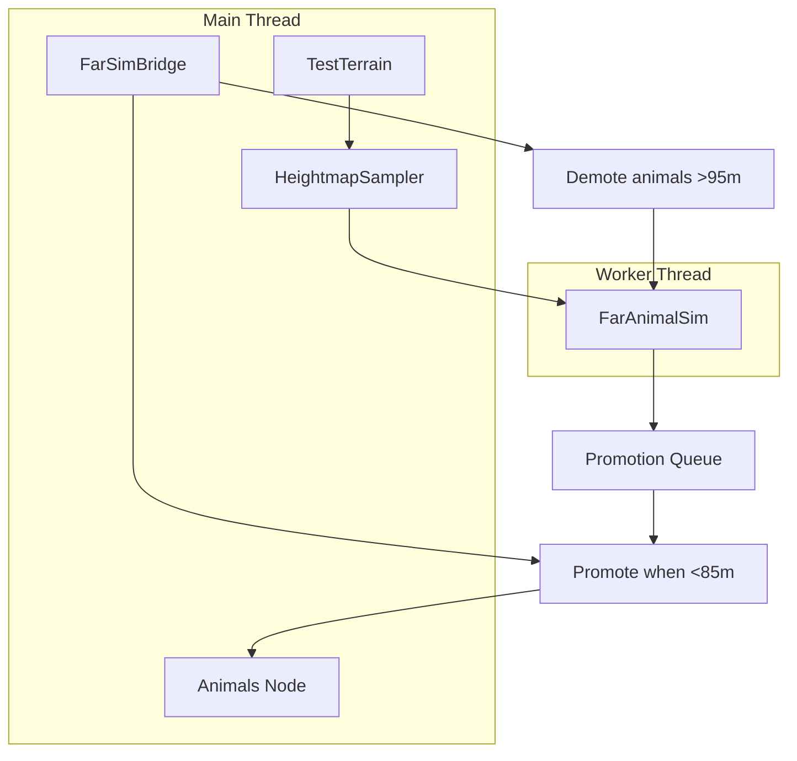
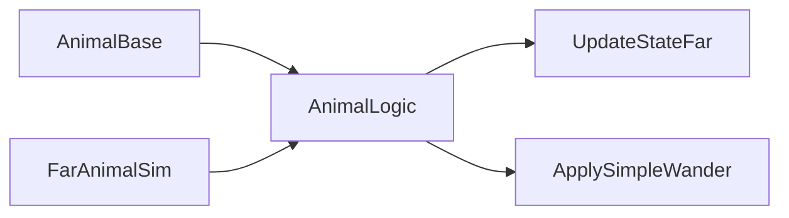

# Simulation System

The simulation system manages spatial partitioning, LOD (Level of Detail), and efficient simulation of animals and plants at various distances from the player.

## LOD Tiers

Animals are categorized into three LOD tiers based on distance from the player:

| Tier | Distance | AI | Movement | Social (Cohesion/Contagion) |
|------|----------|-----|----------|-----------------------------|
| **FULL** | &lt; 30 m | Full update | Full update | Yes |
| **MEDIUM** | 30–90 m | Simplified, reduced tick rate | Simplified | No |
| **FAR** | &gt; 90 m | `process_far_tick` or async sim | Reduced tick rate | Yes (simplified) |

## LOD Tick Intervals

Tick rates are throttled per tier to reduce CPU load:

| Tier | AI Interval (frames) | Move Interval (frames) |
|------|----------------------|------------------------|
| FULL | 30 | 10 |
| MEDIUM | 90 | 30 |
| FAR | 1500 | 100 |

`should_ai_tick_this_frame(lod, instance_id)` and `should_movement_tick_this_frame(lod, instance_id)` use `(frame_counter + instance_id) % interval == 0` to stagger updates across animals.

## Spatial Grid

SimulationManager and FarSpatialGrid use a uniform grid for efficient radius queries.

### Grid API

| Method | Purpose |
|--------|---------|
| `get_animals_in_radius(center, radius, exclude)` | All animals in radius |
| `get_same_species_in_radius(center, radius, species, exclude)` | Same-species for cohesion/contagion |
| `get_hunters_in_radius(center, radius)` | Hunters for forager threat detection |
| `get_plants_in_radius(center, radius)` | Non-consumed plants for foragers |

Grid is rebuilt every `grid_rebuild_interval` frames (default 4).

## FAR Simulation Flow

FAR animals have two execution paths:

1. **In-scene FAR**: `physics_process` disabled; SimulationManager calls `process_far_tick(delta, ai_tick, move_tick)`.
2. **Async FAR**: FarSimBridge demotes animals beyond 95 m into FarAnimalSim; promotes back when within 85 m.

## FarSimBridge

### Demotion

- Every physics frame, FarSimBridge checks each animal in the scene.
- If `distance(player, animal) > DemoteRadius` (95 m): export `AnimalStateData`, enqueue to FarAnimalSim, remove from scene, `QueueFree()`.

### Promotion

- FarAnimalSim runs at 20 Hz on a worker thread.
- Each tick, animals with `distance(player, animal) < 85` are enqueued for promotion.
- Every `ReviewIntervalSeconds` (20 s), FarSimBridge drains the promotion queue and instantiates animals back into the scene.
- `HeightmapSampler.SampleHeight()` provides Y for placement (worker-safe).

## AnimalLogic (Shared FAR Logic)

`AnimalLogic` is a static C# class with **no Godot dependencies**. Used by:

- `AnimalBase.ProcessFarTick()` (in-scene FAR)
- `FarAnimalSim` (async FAR)

### UpdateStateFar

- Contagion: nearby panicking animals can spread panic.
- Panic decay: panic timer decreases; when zero, switch to wander.
- Wander target refresh when arriving at target.

### ApplySimpleWander

- Panic: move away from threat.
- Wander: move toward `WanderTarget`, apply cohesion.
- Uses `AnimalStateData` (pure struct) for all state.

## AnimalStateData

Shared struct for demotion/promotion and FAR simulation:

| Field | Type | Description |
|-------|------|-------------|
| Position, Velocity | Vector3 | Transform and movement |
| State | int | 0=Wander, 1=Panic |
| Species | int | Bison=0, Deer=1, Rabbit=2, Wolf=3, Bear=4 |
| Health | int | For promotion restoration |
| PanicTimer, WanderTimer | float | State timers |
| WanderTarget, ThreatPosition | Vector3 | AI targets |
| WanderSpeed, PanicSpeed, etc. | float | Per-type parameters |

## Debug Mode

Press **` (backtick)** to toggle debug mode. When enabled, SimulationManager shows:

- LOD tier and state on animal labels
- Threat lines (red)
- Cohesion lines (green)
- Detection radii (yellow/cyan)
- Hunter–prey and forager–plant lines
