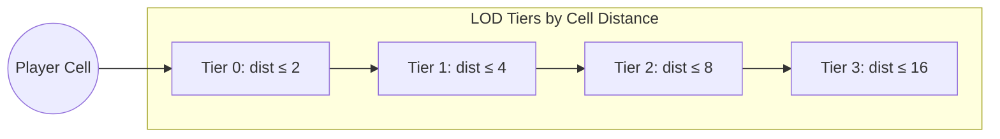
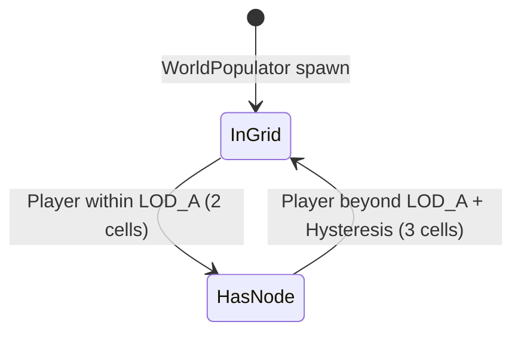
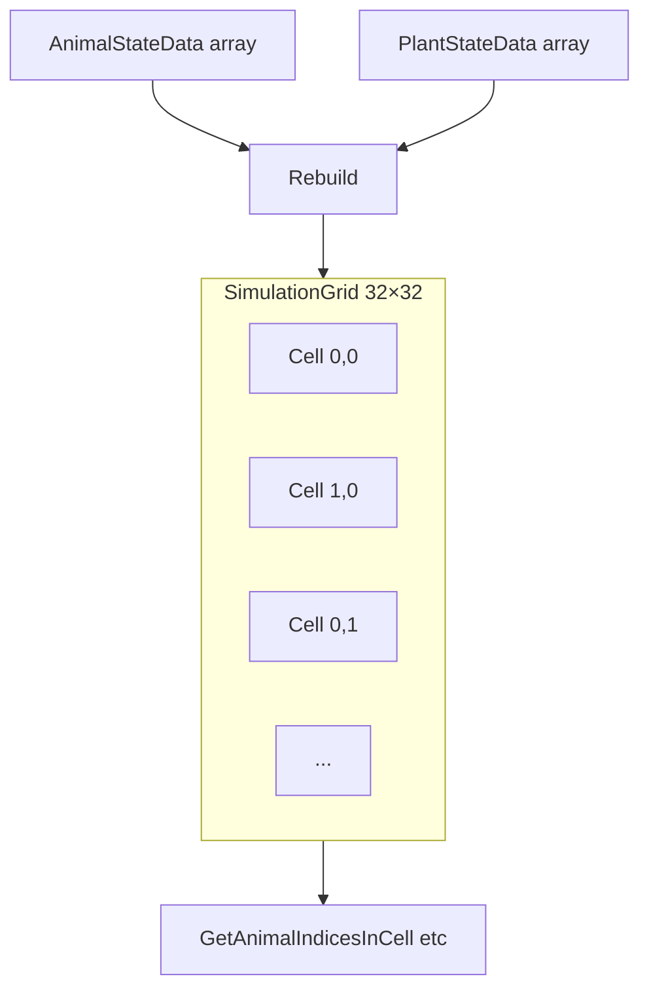
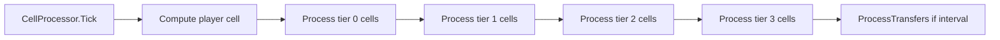
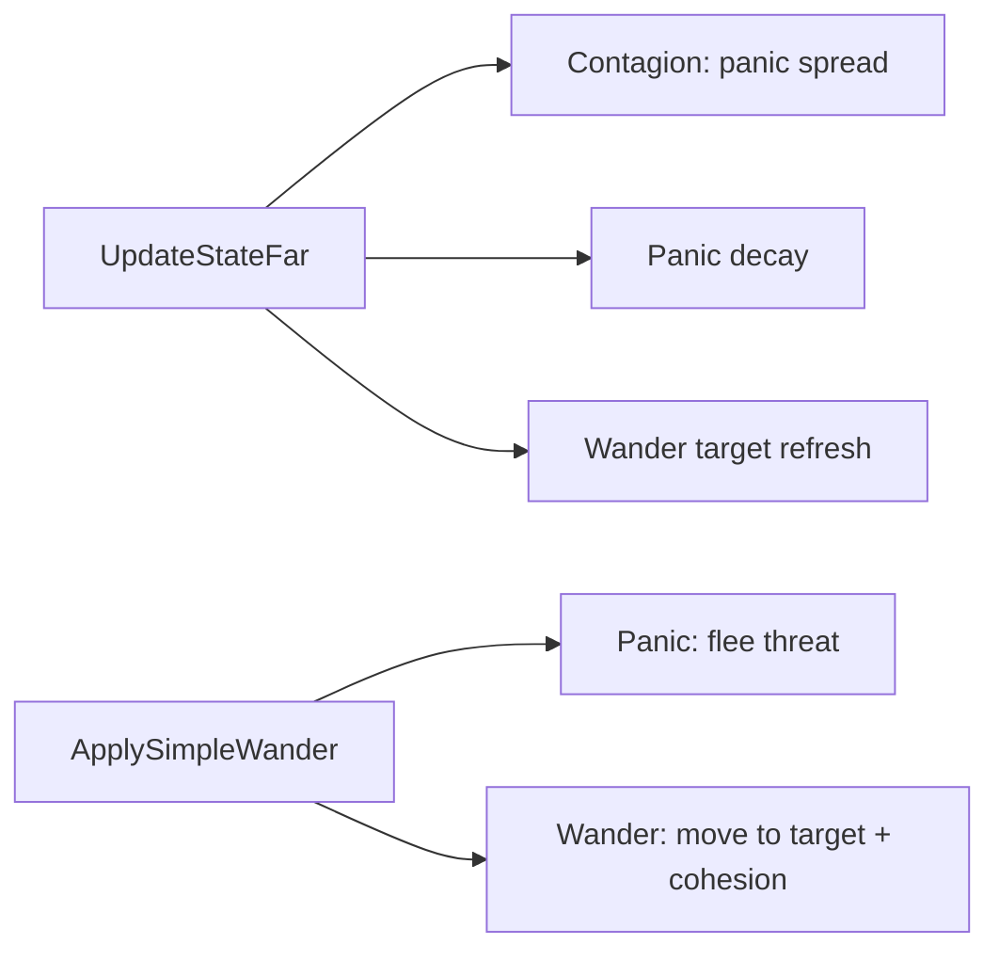

# Simulation System

The simulation manages spatial partitioning, LOD (Level of Detail), and efficient simulation of animals and plants across a 32×32 grid over an 8192×8192 m world.

## LOD Tiers

Cells are assigned LOD tiers based on Manhattan distance from the player cell:

| Tier | Manhattan Distance | Simulation | Godot Nodes |
|------|--------------------|------------|-------------|
| **0** | ≤ 2 cells | Full, every tick | Yes (AnimalNode, PlantNode) |
| **1** | ≤ 4 cells | Full, delta ×1.0 | No |
| **2** | ≤ 8 cells | Simplified, delta ×1.5 | No |
| **3** | ≤ 16 cells | Low-res, delta ×2.0 | No |
| Beyond | > 16 cells | Not simulated | No |

## Promotion and Demotion

- **Promote**: Entity within LOD_A cells of player → create AnimalNode/PlantNode, add to scene.
- **Demote**: Entity beyond LOD_A + LOD_HysteresisCells → remove node, keep state in grid.

Hysteresis prevents thrashing at the boundary.

## Spatial Grid

### Grid API

| Method | Purpose |
|--------|---------|
| `Rebuild()` | Clear and reassign all entities to cells |
| `ProcessTransfers()` | Move entities that crossed cell boundaries |
| `GetAnimalIndicesInCell(cx, cz)` | Animal indices in cell |
| `GetPlantIndicesInCell(cx, cz)` | Plant indices in cell |
| `GetSnapshot(outBuffer)` | Pack [x, z, isAnimal, speciesId, ...] for debug overlay |

### Configuration (SimConfig)

| Constant | Value | Description |
|----------|-------|-------------|
| GridN | 32 | Grid dimension |
| TransferIntervalSeconds | 3.0 | Interval for ProcessTransfers |
| LOD_A_Cells | 2 | Promote threshold |
| LOD_HysteresisCells | 1 | Demote = A + 1 |
| WorldSizeXZ | 8192 | World extent (m) |

## CellProcessor

Drives simulation by iterating cells by LOD tier:

- Tier 0: Full AnimalLogic + PlantLogic; SimSyncBridge syncs positions to nodes.
- Tiers 1–3: Same logic with delta multipliers; no Godot nodes.

## AnimalLogic

Pure C# logic; no Godot APIs. Used by CellProcessor for all tiers.

### Behaviors

- **Contagion**: Nearby panicking same-species can spread panic; nearby calm can shorten panic.
- **Panic**: Flee from `ThreatPosition`; decay timer.
- **Wander**: Move toward random target; pause; cohesion toward same-species center.

## PlantLogic

- **Regrowth**: Health < MaxHealth → increase at PlantRegrowthRate.
- **Respawn**: Health == 0 → increase at PlantRespawnRate.
- **Consumed**: IsConsumed plants excluded from spatial queries.

## Debug Overlay

Press **F1** or **`** to toggle. Shows:

- LOD grid (tier 0 green, tier 1 yellow, tier 2 orange, tier 3 red)
- Animal and plant dots (sampled, capped)
- Player position (cyan)

Optimizations: throttled redraws, SubViewport at lower resolution, snapshot buffer reuse.
