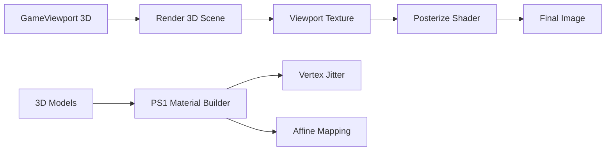

# Visual Style

BiologyGame uses a PS1-style aesthetic: vertex jitter, posterized color, and heavy fog.

## Visual Pipeline

## Shaders

### ps1_style.gdshader

Applied per-model via `PS1MaterialBuilder.apply_to_node()`.

| Effect | Description |
|--------|-------------|
| Vertex jitter | Quantize vertices to simulate low precision |
| Affine mapping | Disable perspective correction on UVs |
| Resolution | Optional texture sampling quantization |

### posterize.gdshader

Screen-space post-process on the game viewport texture.

| Parameter | Default | Description |
|-----------|---------|-------------|
| levels | 32 | Color reduction (~5-bit) |
| grain | 0.06 | Film grain intensity |

### terrain_heightmap.gdshader

Terrain heightmap rendering; samples height texture for vertex displacement.

## PS1 Material Builder

- **Script**: `scripts/props/ps1_material_builder.gd`
- **Usage**: `PS1MaterialBuilder.apply_to_node(model_node)`
- Applied in `AnimalBase._Ready()`, `Plant._ready()`, and similar when `UsePs1Effect` / `use_ps1_effect` is true.

## Environment

- **ps1_environment.tres**: Volumetric fog, sky, lighting.
- Fog density updated by `DayNightWeatherManager` (base + snow multiplier).
- Heavy fog contributes to the low draw-distance, lo-fi look.

## Material Overrides

- `materials/terrain_ground_material.tres` — terrain
- `materials/ps1_ground_material.tres` — PS1-style ground
- Per-model albedo and shader params adjusted for consistency

## Adjusting the Aesthetic

| Target | Location |
|--------|----------|
| Vertex jitter, resolution, affine | `shaders/ps1_style.gdshader` |
| Color levels, grain | `shaders/posterize.gdshader` (or Material params on PosterizeRect) |
| Fog strength, draw distance | `environments/ps1_environment.tres` |
| Surface colors | Material `albedo_color` overrides |
