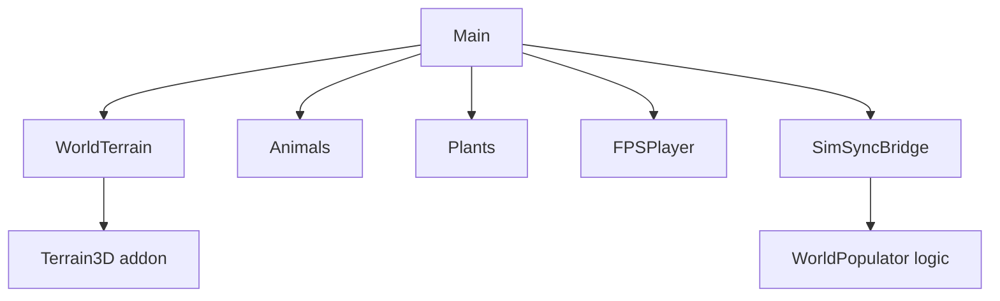
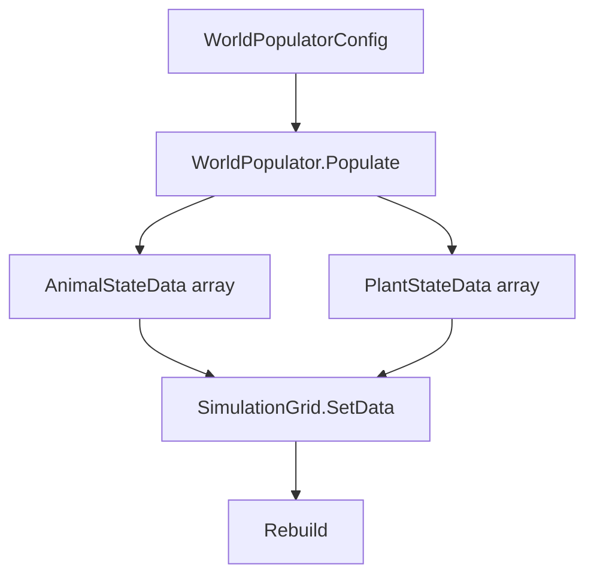

# World & Environment

Terrain, world bounds, and WorldPopulator configuration.

## World Structure

## World Bounds

| Source | Constant | Value |
|--------|----------|-------|
| world_constants.gd | WORLD_SIZE_XZ_METERS | 8192 |
| SimConfig.cs | WorldSizeXZ | 8192 |
| SimConfig.cs | WorldOriginX, WorldOriginZ | 0 |

Keep `world_constants.gd` in sync with Terrain3D import (vertex_spacing, height scale).

## Terrain

- **Terrain3D** addon; Yellowstone heightmap (8192×8192 px at 1 m/px).
- **HeightmapSampler** (C#): Samples terrain on main thread for placement when promoting entities.

## WorldPopulator

Runs at startup in SimSyncBridge._Ready(). Fills animal and plant arrays before grid Rebuild.

### SimSyncBridge Exports

| Export | Default | Description |
|--------|---------|-------------|
| AnimalCount | 2,000,000 | Animals to spawn |
| PlantCount | 4,000,000 | Plants to spawn |
| SpawnWholeMap | true | Distribute across full map |
| SpawnRadius | 600 | If not whole map, circle radius |
| SpawnCenterX, SpawnCenterZ | 400 | Circle center |
| HerbivoreRatio | 0.7 | Fraction herbivores |
| RandomSeed | -1 | -1 = random; ≥0 = fixed seed |

### Spawn Rules

- **Whole map**: Uniform random X, Z in world bounds.
- **Circle**: Random points within SpawnRadius of center.
- Height: Sampled from HeightmapSampler at spawn; applied when promoted.
