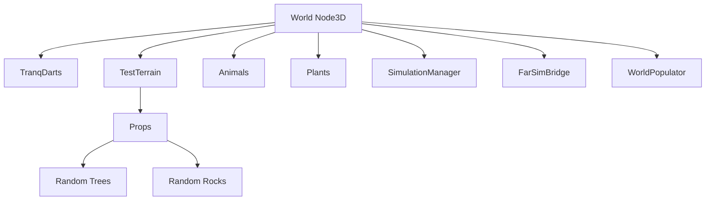
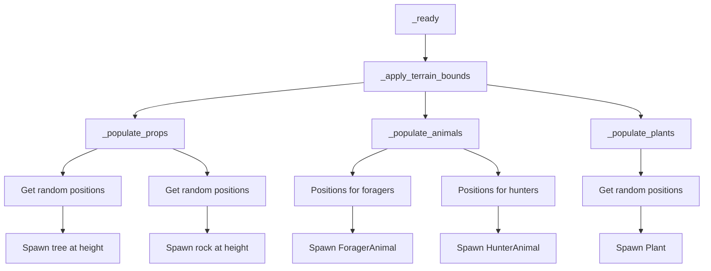
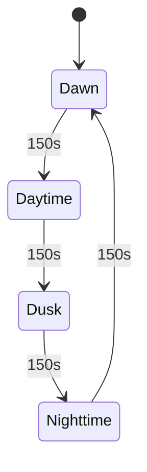
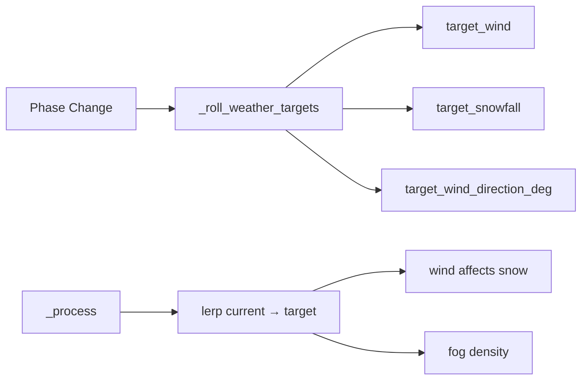

# World & Environment

This document covers terrain, props, world population, day/night cycle, and weather.

## World Structure

## Terrain

- **TestTerrain**: HeightmapTerrain (1000 m) using Yellowstone heightmap.
- Exposes `get_height_at(x, z)` for positioning animals, props, and player spawn.
- `HeightmapSampler` (C#) samples this on the main thread for FarAnimalSim worker use.

## WorldPopulator

Spawns trees, rocks, animals, and plants at runtime with a seed for reproducibility.

### Export Variables

| Variable | Default | Description |
|----------|---------|-------------|
| tree_count | 100 | Trees to spawn |
| rock_count | 100 | Rocks to spawn |
| forager_count | 750 | Foragers (Deer, Rabbit mix) |
| hunter_count | 250 | Hunters (Wolf, Bear mix) |
| plant_count | 1000 | Consumable plants |
| spawn_seed | 12345 | RNG seed |
| clear_radius | 8 | No spawn within this distance of origin |
| terrain_half_size | 250 | Bounds (from terrain or manual) |

### Spawn Rules

- Positions chosen randomly; `_is_clear_of_spawn()` excludes origin area.
- Height validated with `_is_valid_spawn_height()` (default -1000 to 1000).
- Animals placed at `terrain_height + 0.3`.

## Day/Night Cycle

- **Day length**: ~600 s total (configurable).
- **Phases**: Dawn → Daytime → Dusk → Nighttime (4 equal segments).
- **Weather targets** (wind, snowfall, direction) rolled at each phase change.

### Sun & Sky

| Time | Sun | Sky |
|------|-----|-----|
| Day | High, bright | Neutral daylight |
| Dusk/Dawn | Low, warm | Warm horizon |
| Night | Below horizon, dim | Dark blue/purple |

`DayNightWeatherManager` updates:
- `DirectionalLight3D` position, energy, color
- `Environment.ambient_light_*`
- `ProceduralSkyMaterial` colors and energy

## Weather

### Weather Parameters

| Parameter | Effect |
|-----------|--------|
| Wind | Snow particle horizontal drift |
| Snowfall | Particle amount, fog density |
| Wind direction | Snow drift direction (degrees) |

Values interpolate smoothly; targets change only at phase boundaries.

### Snow Particles

- `GPUParticles3D` with `ParticleProcessMaterial`
- Follows player (emission box centered on player + Y offset)
- Collision via `GPUParticlesCollisionHeightField3D` (follows camera, 512 resolution)
- Gravity + wind applied to `process_material.gravity`

### Debug Controls (Arrow Keys)

| Key | Action |
|-----|--------|
| Left | Step time backward |
| Right | Step time forward |
| Up | Increase wind and snowfall |
| Down | Decrease wind and snowfall |

## Plants

- **Plant**: `StaticBody3D` with `max_health` (default 3).
- **consume()**: Decrements health; when 0, emits `plant_depleted`, `queue_free()`.
- **is_consumed()**: Returns true when health <= 0 (filtered out of spatial queries).
- Foragers detect plants via `get_plants_in_radius()`.

## Props

- **RandomTree** / **RandomRock**: Placeholder meshes with PS1 material applied.
- Placed under `TestTerrain/Props` by WorldPopulator.
